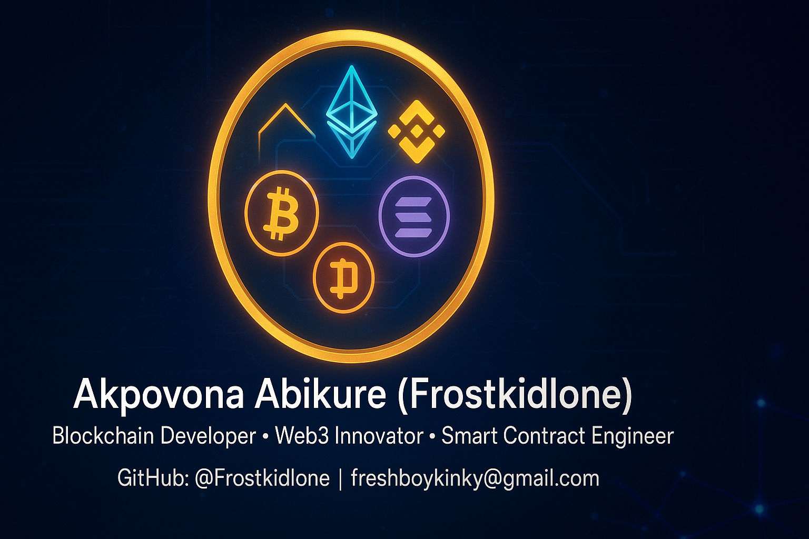

# 👋 Hey, I’m **Akpovona Abikure (Frostkidlone)**  
### *Blockchain Developer • Web3 Innovator • Smart Contract Engineer*  
_“Building trustless systems for a decentralized world.”_

---

## 🧠 About Me
I’m a passionate blockchain developer skilled in designing, deploying, and securing decentralized applications and smart contracts.  
My focus is on building scalable, secure, and innovative blockchain solutions that connect people and technology through Web3.

I specialize in:
- **Smart Contract Development** (Solidity, Rust)
- **Cross-chain Integration** (EVM ↔ Solana)
- **DeFi, NFTs, and DApp Architecture**
- **Secure Infrastructure Design** (ICSN Certified Network Specialist)

---

## 💎 Featured Projects

### 🛒 **P-PayVerse (Pi Ecosystem Hackathon)**
A decentralized e-commerce payment system designed for the Pi Network, integrating multi-wallet checkout and escrow smart contracts.  
> **Stack:** React, Solidity, Web3.js, Firebase, Pi SDK

### 🔗 **Obsydian Protocol (EVM → Solana Migration)**
Redeployment of Solidity contracts to the Solana blockchain using Rust and Anchor. Focused on maintaining DeFi protocol security and integrity.  
> **Stack:** Rust, Anchor, Solana CLI, Ethereum, Node.js

### 💰 **DeFi Staking Contract (BNB Chain)**
Smart contract for decentralized staking and rewards distribution on BSC.  
> **Stack:** Solidity, Hardhat, Web3.js, MetaMask API

### 🎨 **NFT Minting DApp (Ethereum)**
ERC-721 compliant NFT minting contract with metadata hosting and mint UI.  
> **Stack:** Solidity, React, IPFS, Alchemy API

---

## ⚙️ Tech Stack

---

## 🌍 Connect With Me

- 📧 **Email:** [freshboykinky@gmail.com](mailto:freshboykinky@gmail.com)  
- 💻 **GitHub:** [@Frostkidlone](https://github.com/Frostkidlone)

---

### 🧾 Credits
Built with 💡 by **Frostkidlone**  
Blockchain Developer • Web3 Innovator • Smart Contract Engineer
## 📊 GitHub Stats

